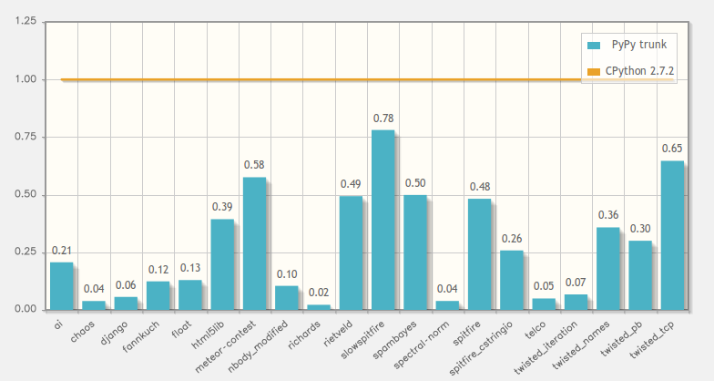
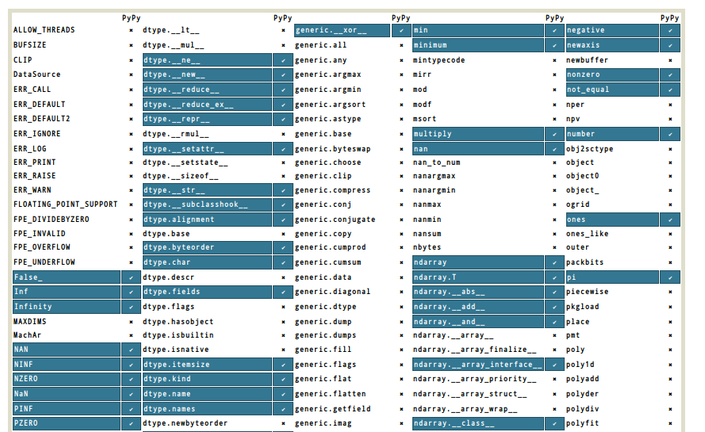

.. include:: beamerdefs.txt

================================
Introduction to PyPy
================================

What is PyPy?
-------------

* PyPy

  - started in 2003

  - Open Source, partially funded by EU and others

  - framework for fast dynamic languages

  - **Python implementation**

* as a Python dev, you care about the latter

Python in Python
-----------------

* Actually: Python in **RPython**

* Restricted Python

  - Statically typed subset

  - never designed to be user friendly

  - still better than C/Java/C# in lots of aspects

  - "we write RPython so you don't have to" (cit.)

* RPython : PyPy = C : CPython ...

* ... Java : Jython = C# : IronPython

RPython
-------

* Run RPython programs on top of CPython

  - isn't it damn slow? Yes.

|pause|

* Compile RPython programs to C

  - this is where the magic happens

PyPy: Software archeology
--------------------------

* Around since 2003

* (advertised as) production ready since December 2010

  - release 1.4

* Funding

  - EU FP6 programme

  - Eurostars programme

  - donations

  - ...

PyPy 1.9: current status
------------------------

* Faster

  - **1.7x** than 1.5 (a year ago)

  - **2.2x** than 1.4

  - **5.5x** than CPython

* Implements Python 2.7.2

* Many more "PyPy-friendly" programs

* Packaging

  - |scriptsize| Debian, Ubuntu, Fedora, Homebrew, Gentoo, ArchLinux, ... |end_scriptsize|

  - |scriptsize| Windows (32bit only), OS X |end_scriptsize|

* C extension compatibility

  - runs (big part of) **PyOpenSSL** and **lxml**

  - numpy (more on that later)

Speed
------

PyPy features
---------------

* JIT

  - automatically generated

  - complete/correct by construction

  - multiple backends: x86-32, x86-64, ARM

|pause|

* Stackless

  - not yet integrated with the JIT (in-progress)

|pause|

* cpyext

  - CPython C-API compatibility layer

  - not always working

  - often working: wxPython, PIL, cx_Oracle, mysqldb, pycairo, ...

|pause|

* compact instances (as using ``__slots__``)

Differences with CPython
-------------------------

* GC: not reference counting

  - ``__del__``, ``weakref``, etc.

|example<| refcounting |>|
|scriptsize|

.. sourcecode:: python

    def foo():
        f = open('/tmp/foo.txt')
        f.write('hello')

|end_scriptsize|
|end_example|

|pause|

|example<| correct way |>|
|scriptsize|

.. sourcecode:: python

    def foo():
        with open('/tmp/foo.txt') as f:
            f.write('hello')

|end_scriptsize|
|end_example|

Obscure details that people rely on
------------------------------------

"There is No Feature Obscure Enough for people not to rely on"

|pause|

- Non-string keys in __dict__ of types

- Exact naming of a list comprehension variable

- Relying on untested and undocumented private stuff

- Exact message matching in exception catching
  code

- Refcounting details

``import numpypy`` (1)
-----------------------

|scriptsize|

* http://buildbot.pypy.org/numpy-status/latest.html

|end_scriptsize|

``import numpypy`` (2)
-----------------------

* in-progress, funded by donations

* JIT-friendly

* almost as fast as the corresponding C code

* be happy with pure Python loops

* the bad news: scipy not there (yet)

numpy quick benchmarks
------------------------

|example<| |small| numpybench.py |end_small| |>|
|scriptsize|

.. sourcecode:: python

    def c_loop(a):
        return numpy.sum(a)

    def pyloop(a):
        sum = 0
        for i in range(len(a)):
            sum += a[i]
        return sum

|end_scriptsize|
|end_example|

|pause|

|example<| |small| numpybench2.py |end_small| |>|
|scriptsize|

.. sourcecode:: python

    def c_loop(a, b, c):
        return numpy.add(a, numpy.multiply(b, c))

    def pyloop(a, b, c):
        N = len(a)
        assert N == len(b) == len(c)
        res = numpy.zeros(N)
        for i in range(N):
            res[i] = a[i] + b[i]*c[i]
        return res

|end_scriptsize|
|end_example|

Real world use case (1)
-----------------------

* LWN's gitdm

  - http://lwn.net/Articles/442268/

  - data mining tool

  - reads the output of ``git log``

  - generate kernel development statistics

|pause|

* Performance

  - CPython: 63 seconds

  - PyPy: **21 seconds**

|pause|

|example<| ``lwn.net`` |>|
|small|

  [...] PyPy is ready for prime time; it implements the (Python 2.x)
  language faithfully, and it is fast.

|end_small|
|end_example|

Real world use case (2)
-----------------------

* **MyHDL**: VHDL-like language written in Python

  - |scriptsize| http://www.myhdl.org/doku.php/performance |end_scriptsize|

  - (now) competitive with "real world" VHDL and Verilog simulators

|pause|

|example<| ``myhdl.org`` |>|
|small|

  [...] the results are spectacular. By simply using a different interpreter,
  our simulations run 6 to 12 times faster.

|end_small|
|end_example|

Real world use case (3)
-----------------------

- Translating PyPy itself

- Huge, complex piece of software

- All possible (and impossible :-)) kinds of dynamic and metaprogrammig tricks

- ~2.5x faster with PyPy

- (slow warm-up phase, though)

- Ouroboros! |snake|

Real world use case (4)
-----------------------

* Your own application

* Try PyPy, it might be worth it

Not convinced yet?
------------------

|example<| Real time edge detection |>|
|small|

.. sourcecode:: python

    def sobeldx(img):
      res = img.clone(typecode='d')
      for p in img.pixeliter():
          res[p] = (-1.0 * img[p + (-1,-1)] +
                     1.0 * img[p + ( 1,-1)] +
                    -2.0 * img[p + (-1, 0)] +
                     2.0 * img[p + ( 1, 0)] +
                    -1.0 * img[p + (-1, 1)] +
                     1.0 * img[p + ( 1, 1)]) / 4.0
      return res
    ...
    ...

|end_small|
|end_example|

Live demo
---------

Is Python slow?
----------------

- |strike<| Python is slow |>|

- Python is hard to optimize

|pause|

- Huge stack of layers over the bare metal

- Abstraction has a cost |pause| (... or not?)

Python is complicated
---------------------

How ``a + b`` works (simplified!):

* look up the method ``__add__`` on the type of a

* if there is one, call it

* if it returns NotImplemented, or if there is none,
  look up the method ``__radd__`` on the type of b

* if there is one, call it

* if there is none, or we get ``NotImplemented`` again,
  raise an exception ``TypeError``

Python is a mess
----------------

How ``obj.attr`` or ``obj.method()`` works:

* ...

|pause|

* no way to write it down in just one slide

Killing the abstraction overhead
--------------------------------

|scriptsize|
|column1|
|example<| Python |>|

.. sourcecode:: python

    class Point(object):

      def __init__(self, x, y):
        self.x = x
        self.y = y

      def __add__(self, q):
        if not isinstance(q, Point):
          raise TypeError
        x1 = self.x + q.x
        y1 = self.y + q.y
        return Point(x1, y1)

    def main():
      p = Point(0.0, 0.0)
      while p.x < 2000.0:
        p = p + Point(1.0, 0.5)
      print p.x, p.y

|end_example|

|pause|

|column2|
|example<| C |>|

.. sourcecode:: c

   #include <stdio.h>

    

    int main() {
        float px = 0.0, py = 0.0;
        while (px < 2000.0) {
            px += 1.0;
            py += 0.5;
        }
        printf("%f %f\n", px, py);
    }

|end_example|
|end_columns|
|end_scriptsize|

.. at this point, we show it in the jitviewer

Pointless optimization techniques
---------------------------------

.. XXX: I'm not sure how useful is this slide

|scriptsize|

|column1|
|example<| |>|

.. sourcecode:: python
   
   #
   for item in some_large_list:
       self.meth(item)

|end_example|
|column2|
|example<| |>|

.. sourcecode:: python

   meth = self.meth
   for item in some_large_list:
       meth(item)

|end_example|
|end_columns|

|pause|

|column1|
|example<| |>|

.. sourcecode:: python
   
   def foo():
       res = 0
       for item in some_large_list:
           res = res + abs(item)
       return res

|end_example|
|column2|
|example<| |>|

.. sourcecode:: python

   def foo(abs=abs):
       res = 0
       for item in some_large_list:
           res = res + abs(item)
       return res

|end_example|
|end_columns|

|pause|

|column1|
|example<| |>|

.. sourcecode:: python

   #

   [i**2 for i in range(100)]

|end_example|
|column2|
|example<| |>|

.. sourcecode:: python

   from itertools import *
   list(imap(pow, count(0), 
             repeat(2, 100)))

|end_example|
|end_columns|

|pause|

|column1|
|example<| |>|

.. sourcecode:: python

   for i in range(large_number):
       ...

|end_example|
|column2|
|example<| |>|

.. sourcecode:: python

   for i in xrange(large_number):
       ...

|end_example|
|end_columns|

|pause|

|column1|
|example<| |>|

.. sourcecode:: python

   class A(object):
       pass

|end_example|
|column2|
|example<| |>|

.. sourcecode:: python

   class A(object):
       __slots__ = ['a', 'b', 'c']

|end_example|
|end_columns|

|end_scriptsize|

Conclusion
--------------

- PyPy is fast

- mature

- stable

- abstractions for free!

|pause|

- (I wonder why you all are still here instead of busy trying PyPy :-))

  * not all C extensions are supported (numpy anyone?)

  * too much memory (sometimes)

Contacts, Q/A
--------------

- http://pypy.org

- blog: http://morepypy.blogspot.com

- mailing list: pypy-dev (at) python.org

- IRC: #pypy on freenode

- http://antocuni.eu

.. image:: question-mark.png
   :scale: 10%
   :align: center

Training session
-----------------

* Run your application under PyPy

How to run PyPy
----------------

* ``pypy program.py``

* That's it!

  - (modulo details)

Challenge
---------

* ``html_fibo.py``

* HTML list of fibonacci numbers

* (the most complicate ever)

* run it on CPython

* run it on PyPy

* fix it!

* http://pypy.org

* http://antocuni.eu/misc/html_fibo.txt

Refcounting vs generational GC (1)
----------------------------------

|scriptsize|
|example<| |scriptsize| ``gc0.py`` |end_scriptsize| |>|

.. sourcecode:: python

   def foo():
       f = file('/tmp/bar.txt', 'w')
       f.write('hello world')

   foo()
   print file('/tmp/bar.txt').read()

|end_example|

|pause|
|example<| |scriptsize| ``gc1.py`` |end_scriptsize| |>|

.. sourcecode:: python

   def foo():
       f = file('/tmp/bar.txt', 'w')
       f.write('hello world')
       f.close() # <-------

|end_example|

|pause|
|example<| |scriptsize| ``gc2.py`` |end_scriptsize| |>|

.. sourcecode:: python

   def foo():
       with file('/tmp/bar.txt', 'w') as f:
           f.write('hello world')

|end_example|
|end_scriptsize|

Refcounting vs generational GC (2)
----------------------------------

* ``__del__``

  - especially files or sockets

  - don't leak file descriptors!

* weakrefs

* ``finally`` inside generators
