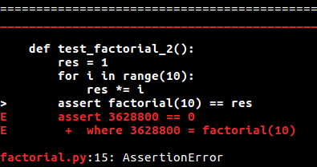
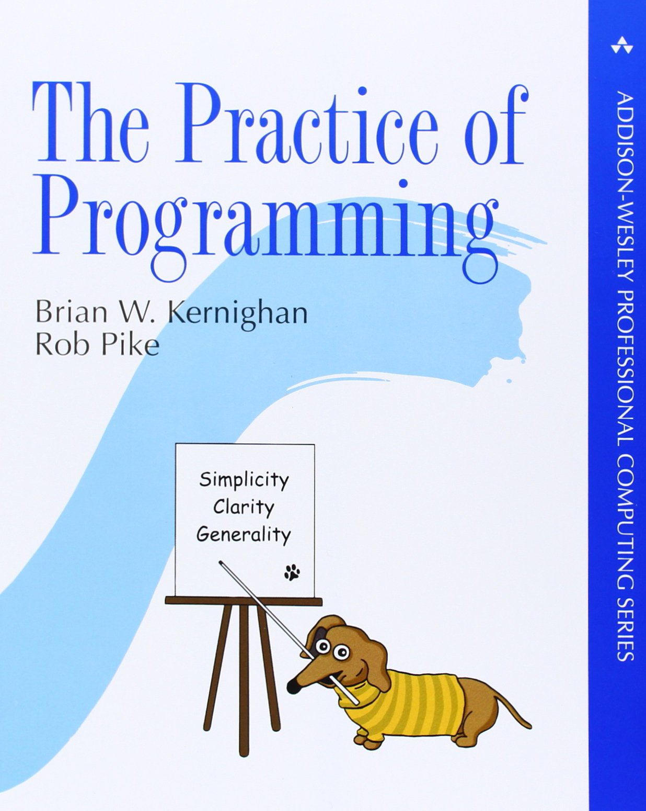

.. include:: beamerdefs.txt

TDD tips tricks
================

About me
---------

- PyPy core dev since 2006

- ``pdb++``, ``cffi``, ``vmprof``, ``capnpy``, ...

- @antocuni

- http://antocuni.eu

  
About you
---------

Either:

* novice programmer

* experienced programmer but new to Python and/or TDD

    
About this talk
---------------

Two parts

* General TDD principles

* Useful patterns and tips

The goal of testing
--------------------

* Make sure that your code works

|pause|

WRONG!

The goal of testing
--------------------

* |strike<| Make sure that your code works |>|

* Make sure that your code does NOT break

Manual testing (1)
------------------

* Feature A

* Write the code

* Start the program

* Navigate through N steps

  - login

  - click on few links

  - push a button

|pause|

* CRASH!

* (repeat)

Manual testing (2)
-------------------

* Feature B

* Modify the code

* Feature B works! :-)

|pause|

* (Feature A no longer works, but you don't notice)

Automated testing (1)
-------------------------

* Write the code for Feature A

* Run a command (~0.5 secs)

  - ``py.test test_foo.py -k test_feature_A``

* CRASH

* (repeat)

Automated testing (2)
--------------------------

* Write the code for Feature B

* Run a command (~0.5 secs)

  - ``py.test test_foo.py -k test_feature_B``

* It works

|pause|

* ``py.test test_foo.py``

* CRASH

* fix

* Everyone is happy :-)

Automated testing (3)
---------------------

* What's the missing piece?

|pause|

* You have to write the test!

* It's just a program

* test frameworks/runners offer a lot of help

  - ``unittest``, ``unittest2``

  - ``nose``

  - **``py.test``**

Test Driven Development
-----------------------

* Goal: make sure that our code does not break

* What is not tested is broken (aka: Murphy's law)

* Even if it's not broken right now, it'll eventually break

Tests first
------------

* Writing code when no test is failing is **forbidden**

* You should write just the code to make the test passing

  - don't cheat :-)

* **Each test must run in isolation**

|pause|

* bonus track: VCS

  - commit every time you write/fix a test

  - write meaningful commit messages

  - don't commit if the tests are broken

  - (unless you are sure it's the right thing to do :-))

  - make you confident in your tests

  - ``{hg,git} bisect``

TDD benefits
------------

* confidence about the quality of the code

* easily spot regressions

* easily find by who/when/why a regression was introduced

* "Why the hell did I write this piece of code?"

  - look at the commit, and the corresponding test

* Remove the code, and see if/which tests fail

  - "One of my most productive days was throwing away 1000 lines of code" (Ken Thompson)

  - "Deleted code is debugged code" (Jeff Sickel)

* **The power of refactoring**

Properties of a good test
--------------------------

- It should FAIL before your fix

  - write the test first, then the code
  
- Determinism

  * NEVER write a test which fails every other run

  * pay attention e.g. to dictionary order

- Easy to READ

  * executable documentation

Readability
------------
  
* A test tells a story

* One feature per test

* **No complex control flow**
  
* Clear failures

  - When a test fails, the poor soul looking at it should be able to
    understand why

Factorial example
-----------------

**Bad**

|small|

.. sourcecode:: python

    def test_factorial():
        for n in (5, 7):
            res = 1
            for i in range(1, n+1):
                res *= i
            assert factorial(n) == res

|end_small|        

Factorial example
-----------------

Factorial example
-----------------

**Better**

|small|

.. sourcecode:: python

    def test_factorial():
        assert factorial(5) == 120
        assert factorial(7) == 5040

|end_small|        

Factorial example
-----------------

**Best**

|small|

.. sourcecode:: python

    def test_factorial():
        assert factorial(5) == 2 * 3 * 4 * 5
        assert factorial(7) == 2 * 3 * 4 * 5 * 6 * 7

|end_small|        

Easy to write
-------------

* We are all lazy, deal with it

* The easiest to write a test, the more likely we'll do

* Invest time in a proper test infrastructure

* Test the infrastructure as well :)

``test_pypy_c`` example
-------------------------

**Bad**

|scriptsize|

.. sourcecode:: python

    def test_call_pypy(tmpdir):
        src = """if 1:
        def factorial(n):
            if n in (0, 1):
                return 1
            return n * factorial(n-1)

        import sys
        n = eval(sys.argv[1])
        print factorial(n)
        """
        pyfile = tmpdir.join("x.py")
        pyfile.write(src)
        stdout = subprocess.check_output(
            ["pypy", str(pyfile), "5"])
        res = eval(stdout)
        assert res == 2*3*4*5

|end_scriptsize|

``test_pypy_c`` example
-------------------------

**Still bad**

|scriptsize|

.. sourcecode:: python

    def execute(tmpdir, src, *args):
        pyfile = tmpdir.join("x.py")
        pyfile.write(src)
        args = ["pypy", str(pyfile)] + list(args)
        stdout = subprocess.check_output(args)
        return eval(stdout)

    def test_call_pypy_2(tmpdir):
        src = """if 1:
        def factorial(n):
            if n in (0, 1):
                return 1
            return n * factorial(n-1)

        import sys
        n = eval(sys.argv[1])
        print factorial(n)
        """
        res = execute(tmpdir, src, "5")
        assert res == 2*3*4*5

|end_scriptsize|

``test_pypy_c`` example
-------------------------

**Good**

|scriptsize|

.. sourcecode:: python

    class TestCall(PyPyTest):

        def test_call(self):
            def factorial(n):
                if n in (0, 1):
                    return 1
                return n * factorial(n-1)
            #
            res = self.run(factorial, 5)
            assert res == 2*3*4*5

|end_scriptsize|

``test_pypy_c`` example
-------------------------

|scriptsize|

.. sourcecode:: python

    @pytest.mark.usefixtures('initargs')
    class PyPyTest(object):

        @pytest.fixture
        def initargs(self, tmpdir):
            self.tmpdir = tmpdir

        def run(self, fn, *args):
            fnsrc = textwrap.dedent(inspect.getsource(fn))
            boilerplate = textwrap.dedent("""
            import sys
            args = map(eval, sys.argv[1:])
            print {fnname}(*args)
            """).format(fnname=fn.__name__)
            src = fnsrc + boilerplate
            args = map(str, args)
            return execute(self.tmpdir, src, *args)

|end_scriptsize|

``test_pypy_c`` example
-------------------------

|scriptsize|

``pypy/module/pypyjit/test/model.py``
  
  - https://bitbucket.org/pypy/pypy/src/5a1232a1c2e6e01422713659c57ae3bcd5db3f70/pypy/module/pypyjit/test_pypy_c/model.py?at=default&fileviewer=file-view-default

``pypy/module/pypyjit/test/test_00model.py``

  - https://bitbucket.org/pypy/pypy/src/5a1232a1c2e6e01422713659c57ae3bcd5db3f70/pypy/module/pypyjit/test_pypy_c/test_00_model.py?at=default&fileviewer=file-view-default

``capnpy/testing/compiler/support.py``

  - https://github.com/antocuni/capnpy/blob/master/capnpy/testing/compiler/support.py

|end_scriptsize|

Decoupling components
----------------------

- Useful in general

- In particular for GUIs

- Leads to a better design

Decoupling components
----------------------

- Google for `tkinter tutorial`

  * http://python-textbok.readthedocs.io/en/1.0/Introduction_to_GUI_Programming.html

Decoupling components
----------------------

|scriptsize|

.. sourcecode:: python

    class Calculator:
        def __init__(self, master):
            ...
            self.total = 0
            self.entered_number = 0
            self.total_label_text = IntVar()
            self.total_label_text.set(self.total)
            self.add_button = ...
            self.subtract_button = ...
            self.reset_button = ...

        def update(self, method):
            if method == "add":
                self.total += self.entered_number
            elif method == "subtract":
                self.total -= self.entered_number
            else: # reset
                self.total = 0
            self.total_label_text.set(self.total)
            self.entry.delete(0, END)

|end_scriptsize|

Decoupling components
----------------------

|scriptsize|

.. sourcecode:: python

    class Calculator(object):

        def __init__(self):
            self.total = 0

        def add(self, x):
            self.total += x

        def sub(self, x):
            self.total -= x

        def reset(self):
            self.total = 0

|end_scriptsize|

Decoupling components
----------------------

|scriptsize|

.. sourcecode:: python

    class GUI(object):
        def __init__(self, master):
            self.calculator = Calculator()
            ...
            self.add_button = ...
            self.subtract_button = ...
            self.reset_button = ...
            self.update_total()

        def update_total(self):
            self.total_label_text.set(self.calculator.total)

        def update(self, method):
            if method == "add":
                self.calculator.add(self.entered_number)
            elif method == "subtract":
                self.calculator.sub(self.entered_number)
            else: # reset
                self.calculator.reset()

            self.update_total()
            self.entry.delete(0, END)

|end_scriptsize|

Decoupling components
----------------------

|scriptsize|

.. sourcecode:: python

    def test_Calculator():
        calc = Calculator()
        assert calc.total == 0
        calc.add(3)
        assert calc.total == 3
        calc.add(5)
        assert calc.total == 8
        calc.sub(7)
        assert calc.total == 1
        calc.sub(10)
        assert calc.total == -9
        calc.reset()
        assert calc.total == 0

|end_scriptsize|

Notation
---------

           
- Chapter 9: Notation

Notation
---------------------

|scriptsize|

.. sourcecode:: python

    ops = [
        MergePoint('merge_point', [sum, n1], []),
        ResOperation('guard_class', [n1, ConstAddr(node_vtable, cpu)], []),
        ResOperation('getfield_gc__4', [n1, ConstInt(ofs_value)], [v]),
        ResOperation('int_sub', [v, ConstInt(1)], [v2]),
        ResOperation('int_add', [sum, v], [sum2]),
        ResOperation('new_with_vtable', [ConstInt(size_of_node),
                                         ConstAddr(node_vtable, cpu)], [n2]),
        ResOperation('setfield_gc__4', [n2, ConstInt(ofs_value), v2], []),
        Jump('jump', [sum2, n2], []),
        ]

|end_scriptsize|

  
Notation
---------

|scriptsize|

https://bitbucket.org/pypy/pypy/src/5a1232a1c2e6e01422713659c57ae3bcd5db3f70/rpython/jit/metainterp/optimizeopt/test/test_optimizeopt.py?at=default&fileviewer=file-view-default

.. sourcecode:: python

    def test_remove_guard_class_1(self):
        ops = """
        [p0]
        guard_class(p0, ConstClass(node_vtable)) []
        guard_class(p0, ConstClass(node_vtable)) []
        jump(p0)
        """
        preamble = """
        [p0]
        guard_class(p0, ConstClass(node_vtable)) []
        jump(p0)
        """
        expected = """
        [p0]
        jump(p0)
        """
        self.optimize_loop(ops, expected, expected_preamble=preamble)

|end_scriptsize|

Q&A
---------------

- unittest2

- nose

- pytest

- tox

