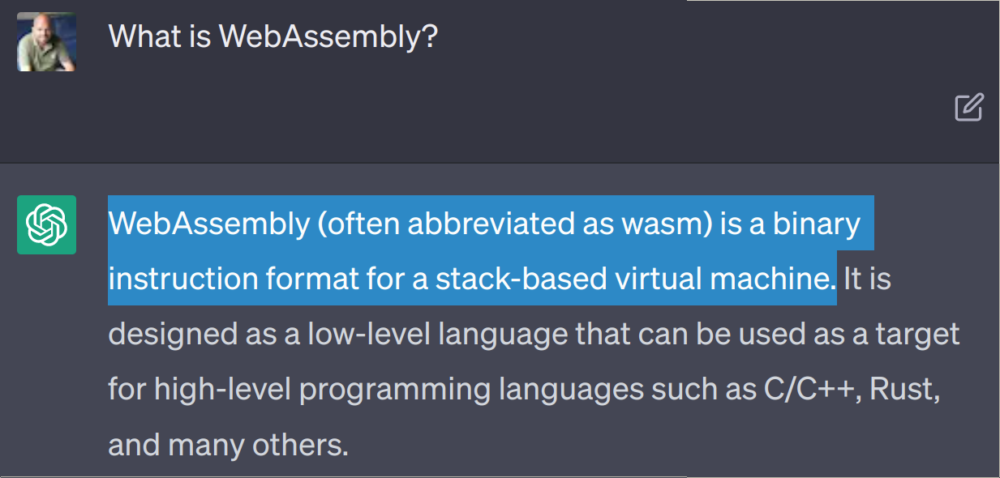
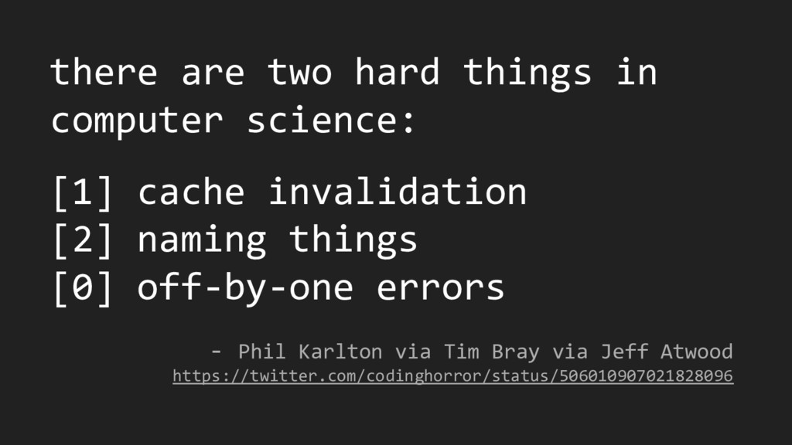

<link rel="stylesheet" href="https://pyscript.net/releases/2023.03.1/pyscript.css" />


<style>
  .reveal h1, .reveal h2, .reveal h3, .reveal h4, .reveal h5 {
    text-transform: none;
  }

  .big {
    font-size: 2.5em;
  }

  .main-size {
    font-size: var(--r-main-font-size);
  }
</style>

## The CPU in your browser:

# WebAssembly Demystified

Antonio Cuni

PyCon DE 2023

---

## Who I am

- @antocuni

- Principal Software Engineer @ Anaconda

- Founder/Maintainer/Core dev of:

  * PyScript

  * HPy

  * PyPy

  * pdbpp++, fancycompleter, capnpy, ...

---

<span class="big fragment strike" data-fragment-index="1">Web</span><span class="big fragment strike" data-fragment-index="2">Assembly</span>

<span class="fragment" data-fragment-index="1">Not (only) for the Web</span>
<br>
<span class="fragment" data-fragment-index="2">Not an assembly (language)</span>

---

<!-- What is WebAssembly? -->



---

### What is WebAssembly?

- **Virtual Machine**

- Completely sandboxed and safe

- WASM runtimes:

  * Browsers, `node.js`, `wasmtime`, `wasmer`, ...

- The most ubiquitous VM ever

- W3C Standard, developed by Bytecode Alliance


---

### WASM as a compilation target


- **Compilation target**: C, C++, Rust, AssemblyScript...

- Near-native performance

- Compile once, run everywhere

- != JVM or .NET: **Low Level** VM

- (but we can't call it LLVM, it's already taken)


---



---

## Hello WebAssembly

```c
int factorial(int n) {
    int result = 1;

    for(int i=1; i<n+1; i++) {
        result *= i;
    }

    return result;
}
```

---


```
	clang \
		--target=wasm32 \
		-nostdlib \
		-Wl,--export-all -Wl,--no-entry, -Wl,--allow-undefined \
		-g \
		-O1 \
		-o factorial.wasm \
		factorial.c
```

---

### WebAssembly Text Format


---

### WAT

```webassembly [1-4,14-25]
(func $factorial (type $t1) (param $p0 i32) (result i32)
  (local $l1 i32) (local $l2 i32)
  (local.set $l1
    (i32.const 1))
  (if $I0
    (i32.gt_s
      (local.get $p0)
      (i32.const 0))
    (then
      (local.set $l2
        (i32.const 0))
      (local.set $l1
        (i32.const 1))
      (loop $L1
        (local.set $l1
          (i32.mul
            (local.tee $l2
              (i32.add
                (local.get $l2)
                (i32.const 1)))
            (local.get $l1)))
        (br_if $L1
          (i32.ne
            (local.get $p0)
            (local.get $l2))))))
  (local.get $l1))
```

---

### Running WASM

```js
var modPromise = WebAssembly.instantiateStreaming(
  fetch("src/factorial.wasm"), {});

async function computeFactorial() {
  const wasmModule = await modPromise;
  const { factorial } = wasmModule.instance.exports;

  const elemIn = document.getElementById('factorial-input');
  const elemOut = document.getElementById('factorial-result');
  const n = parseInt(elemIn.value);
  elemOut.innerText = factorial(n);
}
```

<code>factorial(<input class="main-size" id="factorial-input" size=1></input>) = <span id="factorial-result"></span></code>

<button onClick="computeFactorial();">Compute</button>

---

### Running WASM from Python

```python
from wasmtime import Store, Module, Instance

store = Store()
module = Module.from_file(store.engine, 'factorial.wasm')
instance = Instance(store, module, [])
factorial = instance.exports(store)['factorial']

print("factorial(5) =",  factorial(store, 5))
```

---

### Things you can do with WASM

<ol>
  <li class="fragment">Burn a lot of CPU</li>
  <li class="fragment">That's it</li>
</ol>

---

# Sandboxing

- No file system

- No network

- No I/O

- No system calls

- no libc

---


---

# Imports

- WASM modules can declare *imports*

- Imports are provided **by the host**

- The host has full control over it

---

# Example: files

- `open()`, `read()`, `write()` are imports

- Up to the host:

  * expose the "real" filesystem

  * expose only a part of it

  * expose a completely virtual FS

---

# Emscripten

- Fill the gap between POSIX and WASM

- Compatibility layer for existing/legacy code

- Lots of existing C libs available

  * SDL, zlib, libpng, ...

- Runtime system implemented (mostly) in JS

  * ➜ works only in browsers and `node.js`

---

# WASI

- "Standard library of imports"

- Provided by the host

- Can give access to the "real" system

- Or a virtualized/containerized one

- Or polyfilled in the browser

- Similar problem space as emscripten

---

#### WASI


---

## Upcoming features

- Exception handling

- Gargabe collection

- SIMD instructions

- Threads and atomics

- Component Model

- ...

---

## WASM and Python

- Python compiled to WASM

- Pyodide: Python + scientific libs + JS interop

- MicroPython

- PyScript

- https://pyscript.com

---

## PyScript

<py-repl></py-repl>
